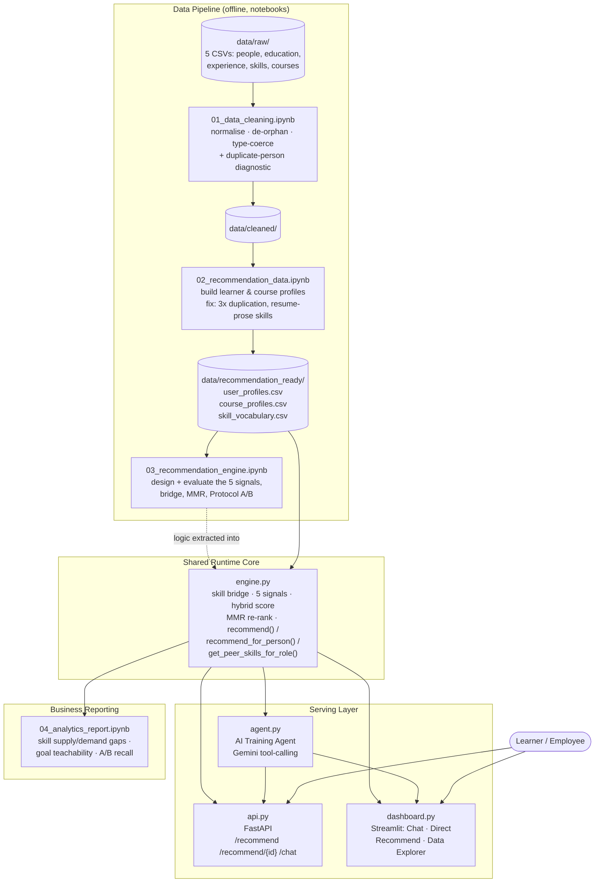
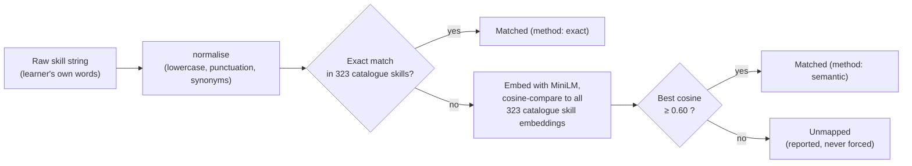
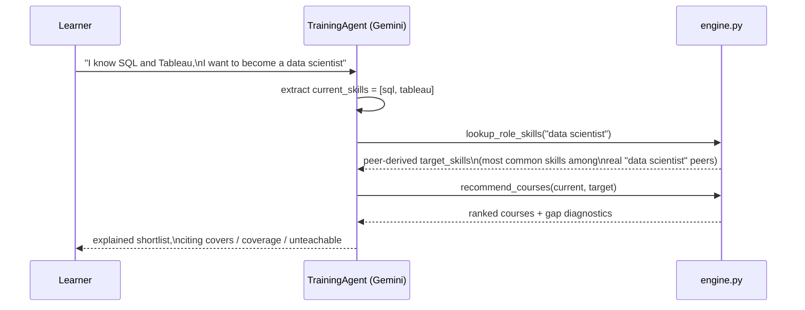

# Skill-Gap Course Recommendation Engine — Presentation Guide

A single reference document covering the problem, the solution, the architecture, the
techniques, and the results — written so each section below can become one slide.
Deeper detail and the full change history live in [`README.md`](README.md) and
[`PROJECT_LOG.md`](PROJECT_LOG.md); this file is the presentation-shaped summary of both.

---

## 1. Business Problem

> **Training departments need customized learning plans for employees based on their
> individual needs and career objectives.**

Today, training recommendations are generic — the same catalogue is pushed at everyone
regardless of what they already know or where they want to go. This causes:

- Low course engagement and completion (irrelevant courses feel like noise)
- Misalignment between training spend and actual career/business needs
- No visibility into *why* a course was suggested, or what skill it closes
- No way to see which employee skill gaps the current catalogue cannot even address

**Goal:** build a system that recommends the right courses to the right person, explains
*why*, and exposes the gaps training cannot yet fill.

---

## 2. Solution — Five Deliverables

| # | Deliverable | What it is |
|---|---|---|
| 1 | **Recommendation Engine** | Hybrid, explainable scoring engine (`engine.py`) |
| 2 | **User Profiling Module** | Learner profiles built from raw HR/resume data (notebooks 01–02) |
| 3 | **AI Training Agent** | Conversational agent, Gemini tool-calling over the engine (`agent.py`) |
| 4 | **Dashboard** | Streamlit UI — chat, direct recommend, data explorer (`dashboard.py`) |
| 5 | **Analytics Report** | Business-facing metrics and charts (`04_analytics_report.ipynb`) |

**Expected results:** improved course engagement/completion, a personalized learning
experience, better alignment between training and career goals, and better visibility into
employee skill development.

---

## 3. End-to-End Architecture



**Design principle:** everything downstream of the data pipeline calls **one** scoring
implementation (`engine.py`). The notebook, the agent, the API, and the dashboard cannot
drift apart because there is only one place the ranking logic lives.

---

## 4. Data Pipeline — What Each Stage Does

```
data/raw/  →  01_data_cleaning.ipynb  →  data/cleaned/  →  02_recommendation_data.ipynb
   (5 raw CSVs)   normalise, de-orphan,        │              reshape into learner/course
                  type-coerce                  │              profiles, repair data quality
                                                ↓
                                     data/recommendation_ready/
                                                ↓
                              03_recommendation_engine.ipynb
                          5 signals → hybrid score → MMR → evaluate
                                                ↓
                                          engine.py
                          (same logic, extracted so agent/api/dashboard can import it)
                                    ↓                    ↓
                          agent.py + api.py       04_analytics_report.ipynb
                        (AI Agent, FastAPI)       (business metrics, charts)
                                    ↓
                            dashboard.py (Streamlit)
```

| Stage | File | Purpose |
|---|---|---|
| Clean | `01_data_cleaning.ipynb` | Column/text normalisation, referential integrity, numeric coercion, duplicate-person diagnostic |
| Profile | `02_recommendation_data.ipynb` | Learner + course profiles, skill vocabulary, the two data repairs (below) |
| Design | `03_recommendation_engine.ipynb` | Skill bridge, five ranking signals, hybrid score, MMR, evaluation |
| Report | `04_analytics_report.ipynb` | Skill supply/demand gaps, goal-teachability, Protocol A/B recall, MMR trade-off |
| Runtime | `engine.py` | Notebook 03's logic as an importable module — one scoring path for every caller |
| Agent | `agent.py` | Gemini tool-calling agent over `engine.py` |
| API | `api.py` | FastAPI: `/recommend`, `/recommend/{person_id}`, `/chat` |
| UI | `dashboard.py` | Streamlit: chat, direct recommend form, catalogue/learner explorer |

---

## 5. Data Quality — Two Repairs That Mattered

Real-world data audits found two defects severe enough to invalidate every downstream
statistic if left uncorrected. This is a strong "we didn't just build a model, we validated
the data first" talking point.

### Repair 1 — The learner population was stacked 3×

Every learner appeared **three times** under three different `person_id`s, offset by a
constant 18,311, with every other column byte-identical. A naive `drop_duplicates(person_id)`
could not catch it because the IDs differed.

```
learner profiles:  54,933  →  18,194   (a 3.02x reduction)
```

**Why it mattered:** it inflated every skill-frequency statistic threefold, and — critically
for evaluation — it would have put the same person on both sides of a train/test split,
making any offline accuracy number meaningless.

**Fix:** de-duplicate on a *content fingerprint* (`name` + `profile_text`) instead of the
untrustworthy ID, keeping the lowest `person_id`. A diagnostic was added to notebook 01 so
future raw-data drops are caught immediately (`person_fingerprint()` warns above a 1.05×
repeat factor).

### Repair 2 — A third of the "skill" vocabulary was resume prose

Skills harvested from resumes included entire bullet points, e.g.
`"maintain multiple database environments redshift rds in aws"` — never matchable to a course.

**Fix:** the 404-course catalogue supplies a ground truth for what a real skill looks like
(323 catalogue skills, 1–5 words, average 2.0). A filter combining a length bound with rules
for bullet-leading verbs and prose connectives was tuned against a **positive control**: it
must keep 100% of the 323 known-good catalogue skills.

```
distinct skills:  201,934  →  132,943
```

---

## 6. The Recommendation Engine — How Ranking Works

### 6.1 The learner → catalogue skill bridge

The learner vocabulary has 132,943 distinct skills; the catalogue has only 323. An exact
string match finds just **237** overlapping skills — leaving the average learner profile
matching ~1.5 catalogue skills, far too sparse to do skill-gap matching.



**Result:** 1.47 → **7.23** catalogue skills matched per profile; zero-match profiles
32.7% → **6.7%**.

### 6.2 Five ranking signals, each on a 0–1 scale

| Signal | Weight | What it measures |
|---|---|---|
| Weighted skill-gap coverage | **0.40** | Fraction of the learner's *weighted* missing skills the course teaches |
| Semantic similarity | 0.25 | MiniLM sentence-embedding similarity between the gap and the course description |
| TF-IDF similarity | 0.15 | Skill-token similarity, weighted so rare skills matter more |
| Course quality | 0.12 | Bayesian-smoothed rating (guards against a 4.9★ from 3 reviewers outranking a 4.6★ from thousands) |
| Difficulty fit | 0.08 | Course level vs. the learner's inferred level |

All five signals are constructed to be independently 0–1 and **candidate-pool independent**,
so they are summed directly — no `MinMaxScaler` (an earlier version scaled *after* filtering
to the candidate pool, which forced the best course in any pool to a score of 1.0 regardless
of how good it actually was, making scores incomparable between learners).

### 6.3 MMR re-ranking for diversity

Two providers (Google, IBM) hold a quarter of the catalogue, and same-provider
specializations are frequently near-duplicates. Pure score-ranking returns repetitive lists.

**Fix:** Maximal Marginal Relevance (λ = 0.75) re-ranks the top candidates, where redundancy
is `max(embedding similarity, same-provider penalty)` — because two courses from the same
provider can be near-duplicate in intent while sitting far apart in embedding space.

```
Before → after MMR:  mean pairwise similarity 0.541 → 0.523
                      distinct providers in top 10   7 → 8
                      cost                            −0.006 mean hybrid score
```

### 6.4 Honest coverage accounting

If a target skill is taught by *no* course, it still counts against the coverage
denominator — it doesn't quietly disappear. Every result also returns `gap.ceiling`, the best
coverage *any single course* could possibly achieve, so a 0.4 score against a 0.4 ceiling is
recognizable as a **perfect** result, not a mediocre one.

---

## 7. Evaluation — Two Protocols, Because the Obvious One Flatters the Engine

There is no real interaction log, so relevance had to be simulated carefully.

| Protocol | Setup | What it actually tests |
|---|---|---|
| **A — Retrieval check** | Hide ⅓ of a learner's skills, hand those *same* skills back as the target | Near-tautological — the engine optimizes for exactly what it was told to find. Confirms the ranker/bridge/index aren't broken. |
| **B — Peer-target prediction** | Target is built from the *most common skills of peers in the same job title* — the engine never sees the held-out skills | Genuine generalization: given who this person is and what their role demands, can the system surface what they're missing? |

### Results (150 learners, recall@10, vs. two baselines)

| recall@10 | Protocol A (retrieval) | Protocol B (peer targets) |
|---|---|---|
| **Engine** | **0.979** | **0.750** |
| Random baseline | 0.374 | 0.378 |
| Popularity baseline | 0.110 | 0.098 |
| **Lift vs. popularity** | 8.90× | **7.65×** |

**Only Protocol B should be read as recommendation quality.** Protocol A's 0.979 is the
expected arithmetic result of the setup — its value is proving the baselines stay low, i.e.
the 404-course catalogue is not a trivial task. **0.750 recall on skills the engine never
saw, with peer-derived targets, is the headline number.**

---

## 8. The AI Training Agent

**Design principle:** the LLM never invents a ranking or a skill list — it only *extracts*
and *grounds*, then calls into `engine.py` for every number it reports. This keeps the
system auditable: every figure in a chat reply traces back to deterministic code, not to the
model's own arithmetic.



Two tools exposed to Gemini:
- **`lookup_role_skills`** — grounds a stated career goal in real peer data
  (`engine.get_peer_skills_for_role`) instead of letting the LLM guess a skill list from its
  own training knowledge. This reuses the same peer-group idea Protocol B evaluates.
- **`recommend_courses`** — the actual ranking call into `engine.recommend()`.

**Engineering issue found and fixed:** `google-genai`'s automatic function-calling loop
closed its internal HTTP client after the first tool round-trip, breaking any turn needing
two sequential tool calls (the agent's main path: look up peer skills, *then* recommend).
Diagnosed by isolating single-tool vs. chained-tool calls; fixed by driving the tool-call
loop manually instead of relying on the SDK's automatic handling.

---

## 9. API & Dashboard

**FastAPI (`api.py`)**
| Endpoint | Purpose |
|---|---|
| `POST /recommend` | Direct engine call — no LLM, no API quota cost |
| `POST /recommend/{person_id}` | Same, but pulls `current_skills` from a stored learner profile |
| `POST /chat` | The AI agent over HTTP, with session state; Gemini quota errors (429) surfaced as proper HTTP status instead of a bare 500 |

**Streamlit dashboard (`dashboard.py`)** — three tabs:
1. **Chat with Agent** — conversational recommendations (session-only API key, never written to disk)
2. **Direct Recommend** — bypasses Gemini entirely; type skills or look up a stored `person_id`
3. **Catalogue & Learner Explorer** — browse/search courses, learner profiles, skill vocabulary

---

## 10. Analytics Report — Business-Facing Findings

`04_analytics_report.ipynb` imports `engine.py` directly, so every figure traces to the exact
code path the agent and API use.

- **Catalogue blind spots:** of the 15 most common learner-side skills, **13 are taught by
  zero courses** (`html`, `css`, `jquery`, `java`, `ajax`, `xml`, `mysql`, `html5`, `git`,
  `bootstrap`, `oracle`, `json`, `css3`, `jsp`, `jira`) — a direct, actionable list of what to
  add to the catalogue.
- **Goal teachability:** across 355 realistic (role, learner) target sets built the same way
  Protocol B builds them, mean `gap.ceiling` is **93.5%**, and 93.5% of goals are fully
  teachable — because peer-derived targets concentrate on skills the catalogue already
  covers well.
- **Independent re-verification:** re-running Protocol A/B through `engine.py` (fresh
  150-learner sample) reproduced 0.979 / 0.749 recall — confirming the extraction from
  notebook 03 into `engine.py` changed nothing about the scoring.

---

## 11. Technology Stack

| Layer | Technology |
|---|---|
| Language | Python 3.13 |
| Data processing | pandas, numpy |
| Semantic embeddings | `sentence-transformers` (`all-MiniLM-L6-v2`, CPU-only, ~90MB) |
| Classical NLP signal | scikit-learn `TfidfVectorizer`, cosine similarity |
| Diversification | Custom greedy MMR implementation |
| AI Agent | Google Gemini (`gemini-3.6-flash`) via `google-genai`, manual tool-calling loop |
| API | FastAPI + Pydantic + Uvicorn |
| Dashboard | Streamlit |
| Notebooks | Jupyter / `ipykernel`, `nbconvert` |
| Analytics/plots | matplotlib, seaborn |

Everything runs on CPU — no GPU required.

---

## 12. Engineering Challenges & How They Were Solved

| Challenge | Resolution |
|---|---|
| 3× duplicated learner population, invisible to `drop_duplicates(person_id)` | Content-fingerprint deduplication + an automated diagnostic added to the cleaning notebook |
| ⅓ of "skills" were resume prose, not real skills | Length + grammar filter, tuned against a positive control (100% of catalogue skills retained) |
| Only 237/132,943 skills matched the catalogue exactly | Three-stage semantic skill bridge (normalise → exact → embedding nearest-neighbour ≥ 0.60) |
| `MinMaxScaler` made scores incomparable across learners | Removed; all 5 signals redesigned to be independently 0–1 and pool-independent |
| MMR using embedding similarity alone *reduced* provider diversity | Redundancy redefined as `max(content similarity, same-provider penalty)` |
| Near-tautological evaluation (headline recall = 0.979 meant nothing) | Added Protocol B (peer-target prediction) as the honest quality measure |
| `difficulty` signal column silently overwrote the `difficulty` display column | Renamed the signal output to `difficulty_fit` |
| Gemini SDK's automatic function-calling broke on 2 sequential tool calls | Replaced with a manual tool-call loop in `TrainingAgent.send` |
| Notebooks 01/02 unrunnable (referenced missing `data/raw/`, `data/cleaned/`) | Rebuilt `data/` layout; added a fallback loader in notebook 02 |

---

## 13. Known Limits

- **Catalogue is small:** 404 courses covering 323 distinct skills — many realistic learner
  goals are simply not teachable by it. `gap.ceiling` makes this visible per request rather
  than hiding it.
- **Quality is a weak signal by construction:** ratings are compressed (mean 4.68, σ 0.17),
  and `review_count` is missing for 75% of courses.
- **Evaluation measures skill retrieval, not learning outcomes** — it cannot capture
  teaching quality, prerequisites, or course ordering.
- **Signal weights (0.40/0.25/0.15/0.12/0.08) are reasoned defaults, not learned** — with
  real interaction data they should be fit, e.g. via grid search against Protocol B.
- **No persistence for embeddings or chat sessions** — every run re-encodes skill/course
  embeddings from scratch; chat sessions are in-memory only.

---

## 14. Roadmap / Future Work

1. **Tune the bridge threshold** against hand-labelled skill pairs instead of eyeballed 0.60.
2. **Learn the hybrid weights** with a grid search or regression against Protocol B recall.
3. **Use `duration` and `type`** (Course / Specialization / Certificate) — currently
   collected but unused in ranking.
4. **Handle cold start** explicitly for the 381 learner profiles with zero valid skills.
5. **Expand the catalogue** — likely the single highest-leverage change; 404 courses over
   323 skills is the binding constraint on recommendation quality.
6. **Persist embeddings** (skip re-encoding every run) and **chat sessions** (survive a
   restart).
7. **Evaluate the agent's free-text skill extraction** against learners' actual stored
   skill lists, not just by manual inspection.
8. **Add automated regression tests** for the three assertions that already caught real
   bugs: the skill-filter positive control, the duplicate-detection ratio, and
   coverage-never-exceeds-ceiling.

---

## 15. Summary — Key Numbers for a Closing Slide

| Metric | Value |
|---|---|
| Learner profiles (after de-duplication) | 18,194 (from a stacked 54,933) |
| Distinct skills (after prose filtering) | 132,943 (from 201,934) |
| Catalogue skills matched per profile, before → after bridge | 1.47 → 7.23 |
| Zero-skill-match profiles, before → after bridge | 32.7% → 6.7% |
| **Protocol B recall@10 (real recommendation quality)** | **0.750** |
| Lift over popularity baseline (Protocol B) | **7.65×** |
| Mean goal teachability (`gap.ceiling`) across realistic targets | 93.5% |
| Course catalogue size | 404 courses / 323 skills |
| Deliverables shipped | Engine, Profiling, AI Agent, Dashboard, Analytics Report — all 5 |
